# capstone 1

## Introduction 
The recent Covid crisis has not only created a health crisis, but also an economic one. Rising unemployment and concurrent supply and demand shocks has put a strain on the US economy and financial system. The US Federal Reserve periodically does stress testing on banks twice a year to ensure their stability largely in part due to the 2008 crisis. Regional banks with holdings 100 billion to 250 billion have been given an exemption for the 2021 year2.  

The goal of this study is to examine the filings of Texas Capital One Bank (TCBI) and its quarterly/annual filings in an effort to understand their current stress levels and weaknesses.  Texas Capital One Bank was chosen because of its location.  Due to the shale industry in the permian basin being particularly affected by Covid, and more recently a weather freeze incapacitating a large portion of Texas' energy grid, a close examination of one of the largest banks in Texas was chosen. 

## Methods
Holding companies with assets greather than $10 Billion USD are required to file reports with the US Federal Reserve and those reports are posted quarterly on the [Federal Financial Institutions Examination Council](https://www.ffiec.gov/)  Data cleaning and graphing functions were done on the csv file posted on the FFIEC website with code found in SRC folder of the corresponding bank. With the guidance of the [Fed reserve Bank Holding Company Performance Report User guide](https://www.federalreserve.gov/boarddocs/supmanual/bhcpr/UsersGuide13/0313.pdf).  Comparison peer group are Banks with colsolidated assets equal to or great than $10 Billion (USD) with an n = 130.

## Results

[Figure1.1]
    

      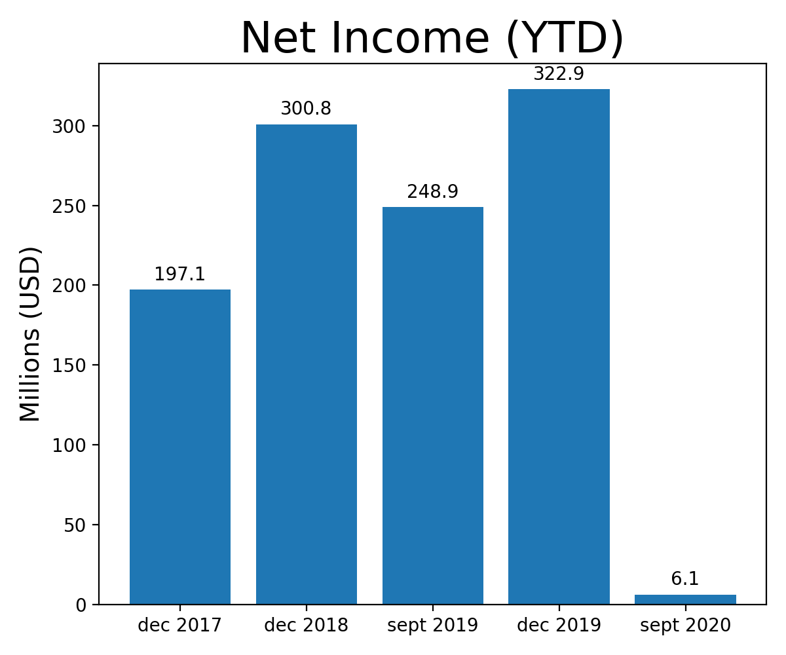
    

 
Dramatic drop off in Net Income for 2020 Texas Captial One Bank.  Note: timepoints are offset, but demonstrate generally that TCBI has a dramatic change in net income year over year.

[Figure1.2]

    

    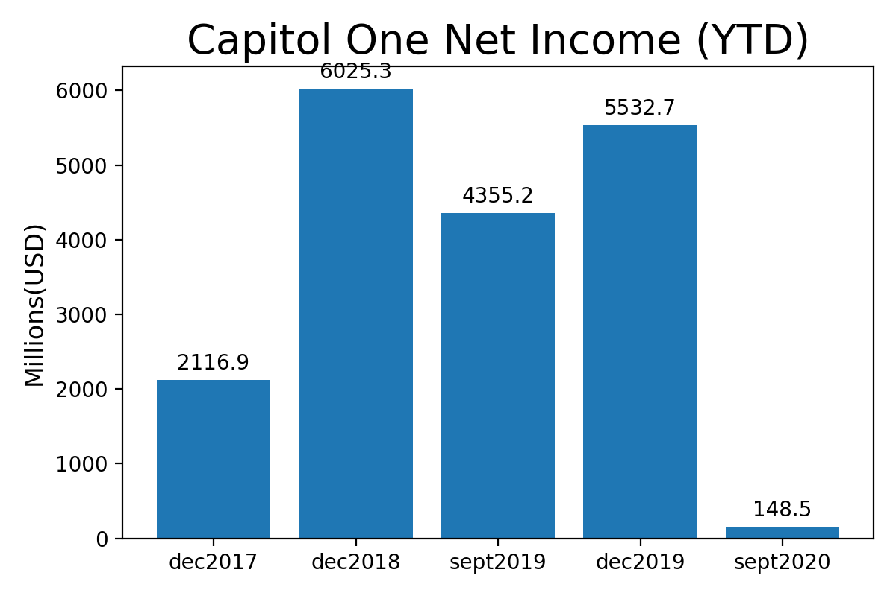
    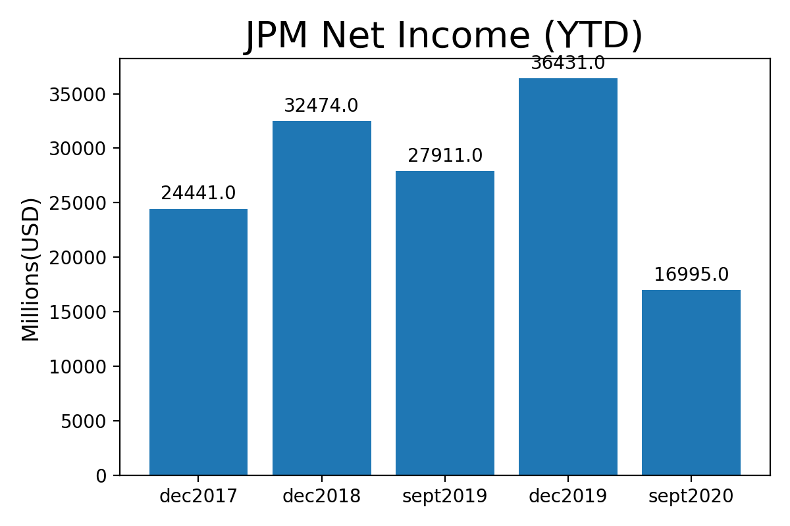
    

    

    

    

        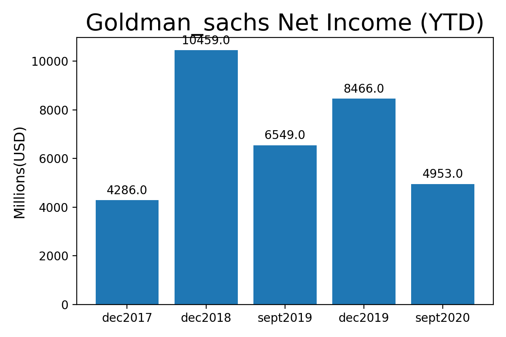
         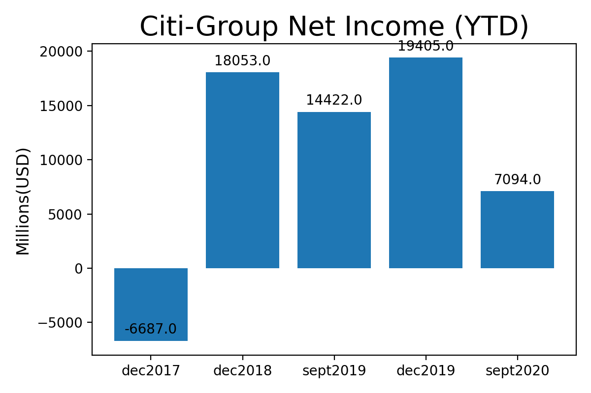
    

A sampling of other banks net profits at the same time points.  All have varying amounts of profitabilty for Sept 2020 timepoint, but if compared to their own sept 2019 timepoint, all sampled banks have reduced net income for sept 2020.

[Figure1.3]
    

      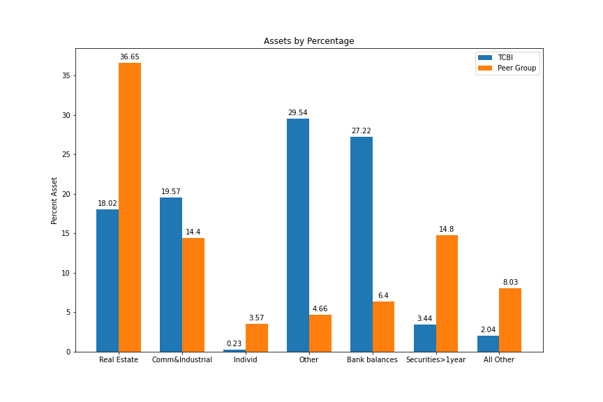
    

 

Loan Portfolio (Assets) of Texas Capital One.  
Note:    
      1) higher than average commericial and industrial loans  
      2) How variable TCBI is vs the average peer group loan types

[Figure1.4]
    

      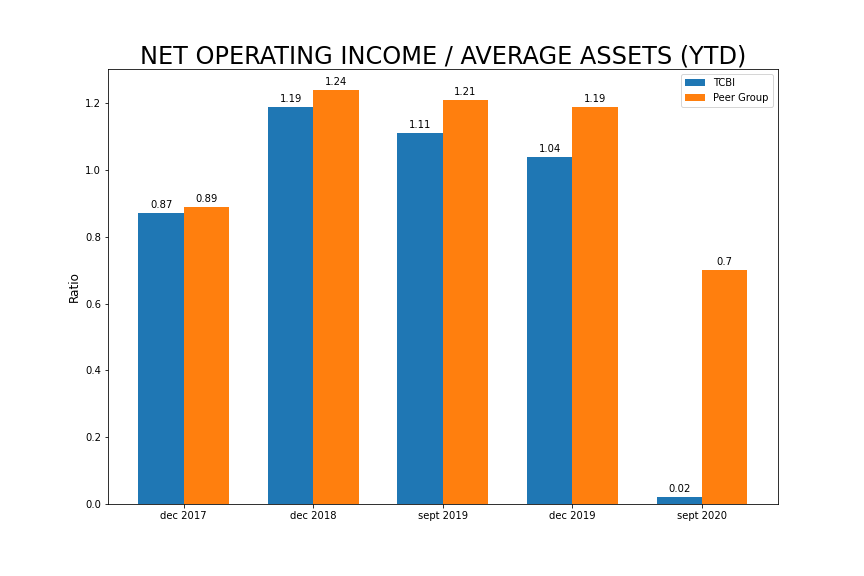
    

 

Income per Asset. This indicates that assets are producing small quantities of income relative to other banks or potentially, the average asset(loan) size has grown, or a combination of the two.

[Figure1.5]
    

      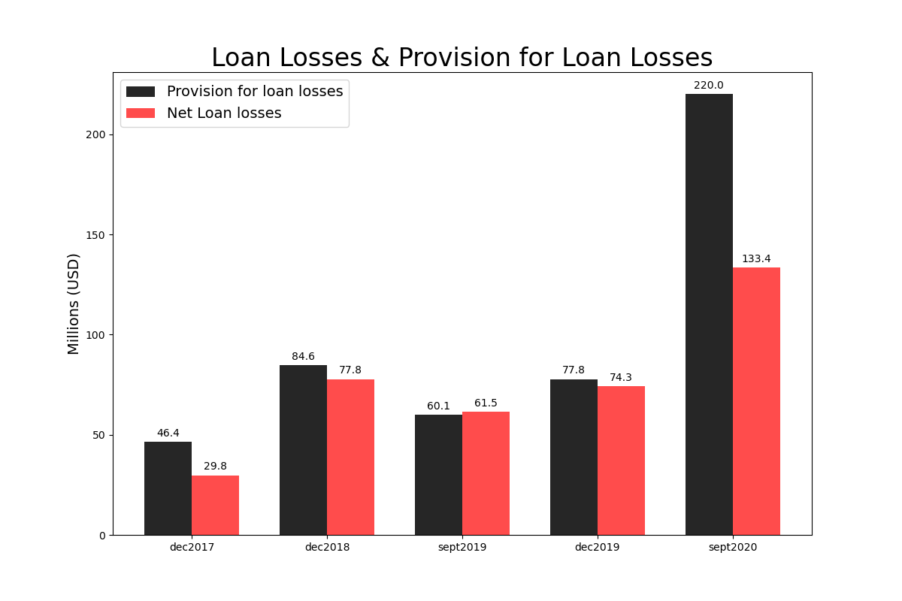
    

 

TCBI has increased their provisions for loan losses by 3x vs the same time point in Sept 2019, and their net loan losses are currently close to 2x.

[Figure1.6]

    

    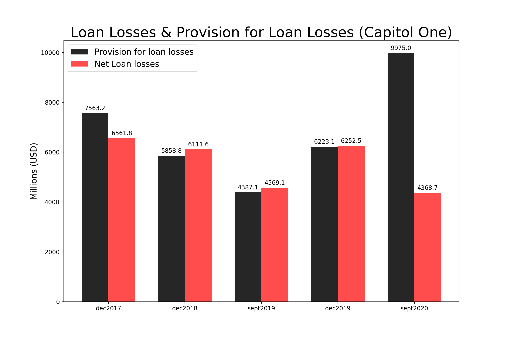
    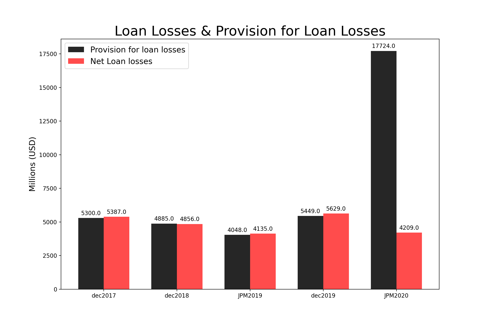
    

    

    

    

        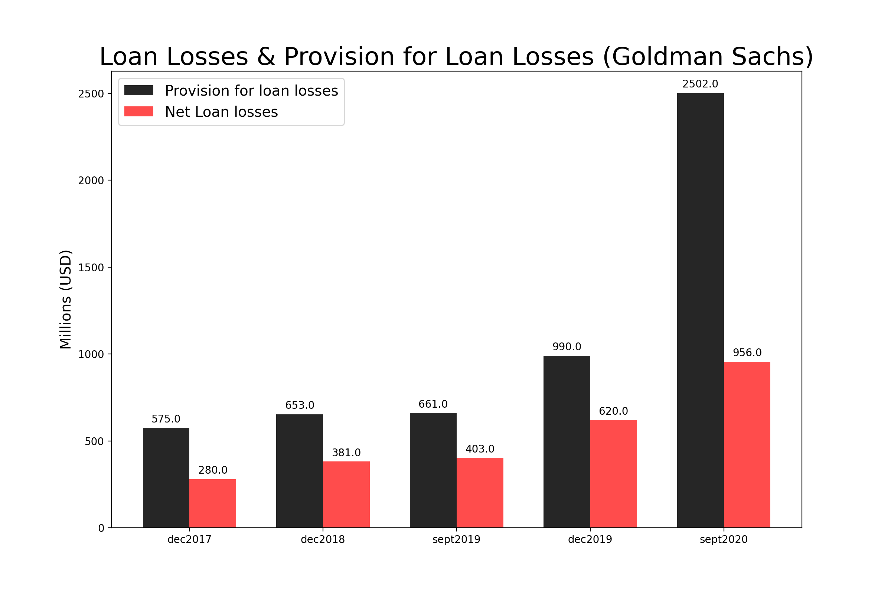
         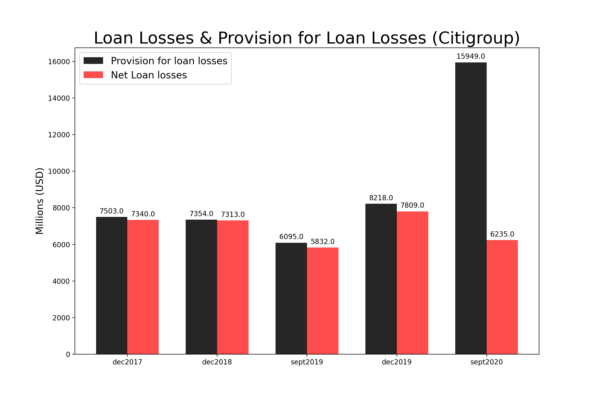
    

All banks sampled dramtically raised loan loss provisions, likely in anticipation of higher rate of non-performing loans

[Figure2.0]
    

      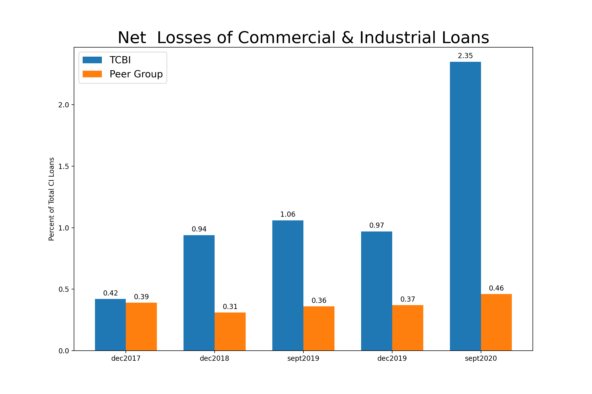
    

 
Texas Capital One Bank has increased Net Losses of Commercial & Industrial(CI) loans by more that 100% year over year. And as compared to its peer group, has roughly 5x total CI loans are catagorized as Net Losses.

[Figure2.1]
    

      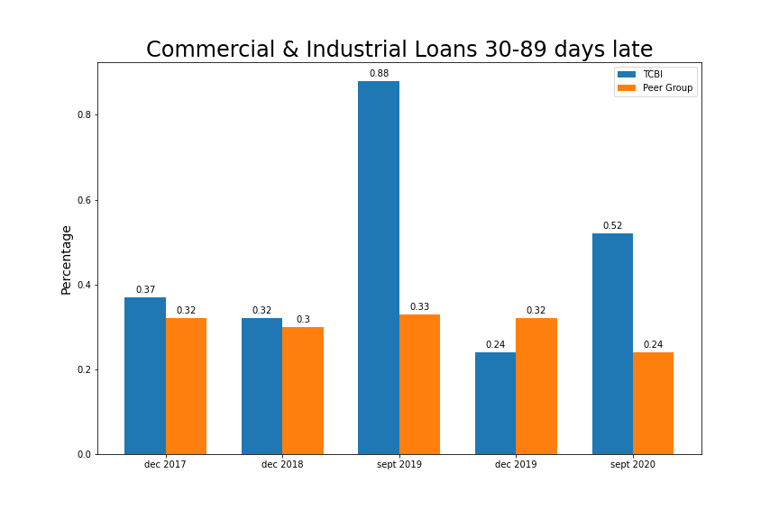
    

 

Indicates that the TCBI has a larger portion of loans that are in early phases of non-performance vs its peer group But also shows that TCBI had a large portion of loans that were no longer catagorized as 30-89 days late between Sept 2019 and Dec 2019 filings.

## Conclusions
It does seem that TCBI has been significantly less profitable in 2020, and their non-performing loans have grown relative to 2019, but they have also allocated a larger portion of their assets to loan loss provisions and short term highly-liquid positions.  Without a full test-suite and understanding of bank fundamentals, I believe the only thing we can say with some certainy is that TCBI is under a larger degress of financial stress than 2019. 

This analysis does have the underpinnings of a proof of concept of a quarterly analysis and vizualizations of FFIEC filings. With the code in the SRC folder, it does seem possible to get a course view of the current state of a bank relative to its previous position and potentially its peer group.

A potential side effect of openly available toolset of bank analysis tools is that it may cause behavior changes in the banking sector due to the optics of their balance sheet.  "Sunlight is the best disinfectant"
  

## Future Directions
Ideally, a more comprehensive test and analysis of the filings would be made.  Also, I would like to automate the inputs to only have the csv file read in and the current quarter date as inputs and have the scripts run and return graphs and alaysis to make scalability and portability to other banks better.

Also, on the macro-economic question... Most banks seemed to have dramatically increased their loan loss provisions.  What allocations were they taken from, Who did not receive those loans, and with all the debt payment moritoriums, who is holding the bag?

## Acknowledgements
DSI Denver Immersive staff/cohort  
kayla Thomas  
Jess Curley  
Chris Reger  
Ian Hetterich  
Travis Koenigsknecht  
Scrum group 1  

  

## Sources 
<a id="1">[1]</a> 
[FFIEC]
(https://www.ffiec.gov/npw/Institution/TopHoldings)  

<a id="1">[2]</a> 
[American Banker]
(https://www.americanbanker.com/news/fed-details-stress-test-scenarios-for-2021#:~:text=The%20Fed%20conducts%20two%20separate,do%20so%20by%20April%205)

<a id="1">[3]</a> 
[Texas.gov]
(https://www.dob.texas.gov/sites/default/files/files/Applications-Forms-Publications/Publications/Top-Banks/top0319.pdf)  

<a id="1">[4]</a> 
[Fed reserve Bank Holding Company Performance Report]
(https://www.federalreserve.gov/boarddocs/supmanual/bhcpr/UsersGuide13/0313.pdf)

<a id="1">[5]</a> 
[Fed Reserve Assessment of Bank Capital during the Recent Corona Virus Event]
(https://www.federalreserve.gov/publications/files/2020-sensitivity-analysis-20200625.pdf)

 <!--  -->
 
