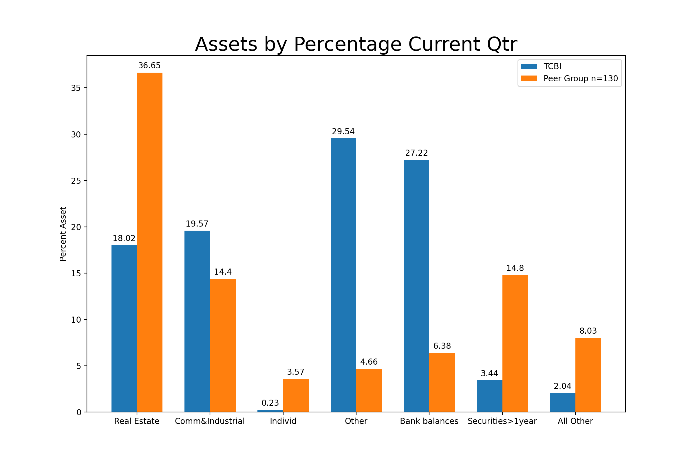

# capstone1

## Introduction 
The recent Covid crisis has not only created a health crisis, but also an economic one. Rising unemployment and concurrent supply and demand shocks has put a strain on the US financial system. The US federal reserve periodically does stress testing on banks to ensure their stability largely in part due to the 2008 crisis fallout. Regional banks with holdings 100 billion to 250 billion have been given an exemption for 2021.  

The goal of this study is to examine the filings of Texas Capital One Bank (TCBI) and its quarterly/annual filings in an effort to understand their current stress levels and weaknesses.  Texas Capital One Bank was chosen because of its location.  Due to the shale industry in the permian basin being particularly affected by Covid, and more recently a weather freeze incapacitating a large portion of Texas' energy grid a close examination of one of the largest banks in texas was chosen. 

## Methods
Holding companies with reported total assets are required to file reports with the Federal Reservere and those reports are posted quarterly on the [Federal Financial Institutions Examination Council](https://www.ffiec.gov/)  Analysis was done on the csv file posted on the FFIEC website with code found in SRC folder.

## Results

[Figure1.1]
    

      
    

 

[Figure1.2]
    

      
    

 

[Figure1.3]
    

      
    

 

[Figure1.4]
    

      
    

 

## Conclusions

## Future Directions

## Sources 

https://www.americanbanker.com/news/fed-details-stress-test-scenarios-for-2021#:~:text=The%20Fed%20conducts%20two%20separate,do%20so%20by%20April%205.

https://www.dob.texas.gov/sites/default/files/files/Applications-Forms-Publications/Publications/Top-Banks/top0319.pdf

## Acknowledgements
